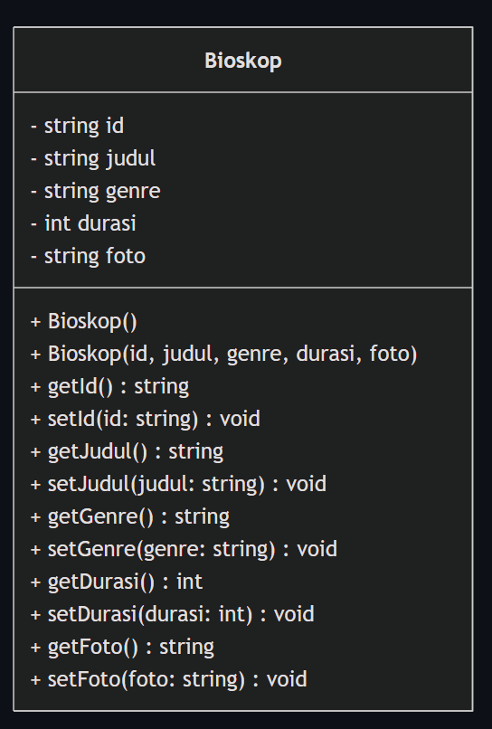

# TP1 DPBO 2026 — Pengelolaan Data Film Bioskop

Repositori Tugas Praktikum 1 (TP1) mata kuliah Desain dan Pemrograman Berorientasi Objek (DPBO), Program Studi Ilmu Komputer, Universitas Pendidikan Indonesia, Tahun Ajaran 2025/2026.

---

##  JANJI
Saya **Riza Wahyu Nugraha** dengan **NIM 2511421** mengerjakan **Tugas Praktikum 1** dalam mata kuliah **Desain dan Pemrograman Berorientasi Objek** untuk keberkahan-Nya maka saya tidak melakukan kecurangan seperti yang telah dispesifikasikan. Aamiin.


##  DESAIN PROGRAM & KELAS

Program ini merupakan sistem manajemen data film bioskop berbasis pemrograman berorientasi objek (*Object-Oriented Programming*) yang diimplementasikan dalam 4 bahasa pemrograman: **C++**, **Java**, **Python**, dan **PHP**.

### 1. Perancangan Kelas `Film`
Class tunggal `Film` merepresentasikan entitas objek film dengan atribut-atribut berikut:

| Atribut | C++ | Java | Python | PHP | Deskripsi |
| :--- | :--- | :--- | :--- | :--- | :--- |
| **ID Film** | `string idFilm` | `String idFilm` | `__id_film` | `$idFilm` | Identifier unik film (*case-sensitive*) |
| **Judul** | `string judul` | `String judul` | `__judul` | `$judul` | Judul tayangan film |
| **Genre** | `string genre` | `String genre` | `__genre` | `$genre` | Kategori/genre film |
| **Durasi** | `int durasi` | `int durasi` | `__durasi` | `$durasi` | Durasi putar film (1–999 menit) |
| **Gambar** | *-* | *-* | *-* | `$gambar` | Path file poster film (khusus web PHP) |

### 2. Diagram Kelas (UML Class Diagram)
Berikut adalah visualisasi rancangan class diagram yang digunakan pada sistem ini:

<p align="center">
  
</p>

### 3. Struktur Penyimpanan Data (In-Memory Array of Objects)
- **C++:** Menggunakan `std::vector<Film>` untuk menampung objek film secara dinamis.
- **Java:** Menggunakan `java.util.ArrayList<Film>` sebagai wadah koleksi objek.
- **Python:** Menggunakan struktur data `list` bawaan Python yang menyimpan instansiasi class `Film`.
- **PHP:** Menggunakan array objek yang disimpan pada `$_SESSION['dataFilm']` sehingga data tetap bertahan antar request browser tanpa perlu database fisik.

---

##  FITUR UTAMA

1. **Tambah Data (Create):** Menambahkan data film baru ke dalam sistem setelah memvalidasi bahwa ID belum pernah digunakan sebelumnya.
2. **Tampilkan Data (Read):** Menampilkan seluruh daftar film yang tersimpan dalam format tabel atau daftar terstruktur.
3. **Update Data (Update):** Memperbarui atribut (Judul, Genre, Durasi, serta Gambar di PHP) berdasarkan pencocokan ID film. ID bersifat permanen/kunci unik.
4. **Hapus Data (Delete):** Menghapus objek data film dari koleksi berdasarkan ID film.
5. **Cari Data (Search):** Melakukan pencarian film spesifik berdasarkan input ID dan menampilkan detail atributnya.

---

##  ALUR KODE & ERROR HANDLING

Setiap program dilengkapi mekanisme validasi input dan penanganan kesalahan (*error handling*) di setiap fungsinya:
- **Validasi ID Unik:** Mencegah penambahan data baru apabila ID yang diinput sudah terdaftar dalam sistem (`"ID sudah digunakan."`).
- **Validasi Durasi (1–999 Menit):** Memastikan durasi berupa bilangan bulat positif dalam batas logis bioskop. Input huruf, simbol, bilangan negatif, atau nol akan ditolak dan meminta input ulang.
- **Validasi Input Kosong:** String kosong atau hanya spasi tidak diizinkan untuk ID, Judul, dan Genre (`"Input tidak boleh kosong."`).
- **Pencarian / ID Tidak Ditemukan:** Memberikan informasi yang jelas jika ID yang dicari, diupdate, atau dihapus tidak ada di daftar (`"Film tidak ditemukan."`).
- **Kondisi Data Kosong:** Menampilkan keterangan (`"Data masih kosong."`) apabila pengguna membuka menu tampilkan data saat belum ada film yang diinput.

---

##  DOKUMENTASI OUTPUT PROGRAM

Berikut adalah dokumentasi hasil uji coba eksekusi program di ke-4 bahasa pemrograman:

###  1. Output Program C++ (CLI)

#### a. Menambahkan Data Film


#### b. Menampilkan Seluruh Data


#### c. Memperbarui Data (Update)


#### d. Mencari Data (Search)


#### e. Menghapus Data (Delete)


#### f. Error Handling & Validasi Input


---

###  2. Output Program Java (CLI)

#### a. Menambahkan Data Film


#### b. Menampilkan Seluruh Data


#### c. Memperbarui Data (Update)


#### d. Mencari Data (Search)


#### e. Menghapus Data (Delete)


#### f. Error Handling & Validasi Input


---

###  3. Output Program Python (CLI)

#### a. Menambahkan Data Film


#### b. Menampilkan Seluruh Data


#### c. Memperbarui Data (Update)


#### d. Mencari Data (Search)


#### e. Menghapus Data (Delete)


#### f. Error Handling & Validasi Input


---

###  4. Output Program PHP (Web Application)

#### a. Menambahkan Data Film & Upload Poster


#### b. Menampilkan Seluruh Data Tabel dengan Poster


#### c. Memperbarui Data (Form Edit Film)


#### d. Mencari Data Film Berdasarkan ID


#### e. Menghapus Data Film


#### f. Error Handling (ID Duplikat & Validasi Input)


---

##  STRUKTUR REPOSITORI

```text
TP1DPBO2526C1/
├── CPP/
│   ├── Film.cpp
│   └── main.cpp
├── Java/
│   ├── Film.java
│   └── Main.java
├── Python/
│   ├── Film.py
│   └── main.py
├── PHP/
│   ├── Film.php
│   ├── Main.php
│   └── images/
├── Dokumentasi/
│   ├── CPP/
│   ├── Java/
│   ├── Python/
│   └── PHP/
├── .gitignore
├── class.png
└── Readme.md
```

---

##  CARA MENJALANKAN PROGRAM

Buka terminal pada direktori folder masing-masing bahasa:

### 1. Menjalankan C++
```bash
cd CPP
g++ -std=c++11 main.cpp -o main
./main       # Pada Windows gunakan: .\main.exe
```

### 2. Menjalankan Java
```bash
cd Java
javac Film.java Main.java
java Main
```

### 3. Menjalankan Python
```bash
cd Python
python main.py
```

### 4. Menjalankan PHP
Jalankan server lokal bawaan PHP:
```bash
cd PHP
php -S localhost:8000
```
Buka browser dan kunjungi: `http://localhost:8000/Main.php`
